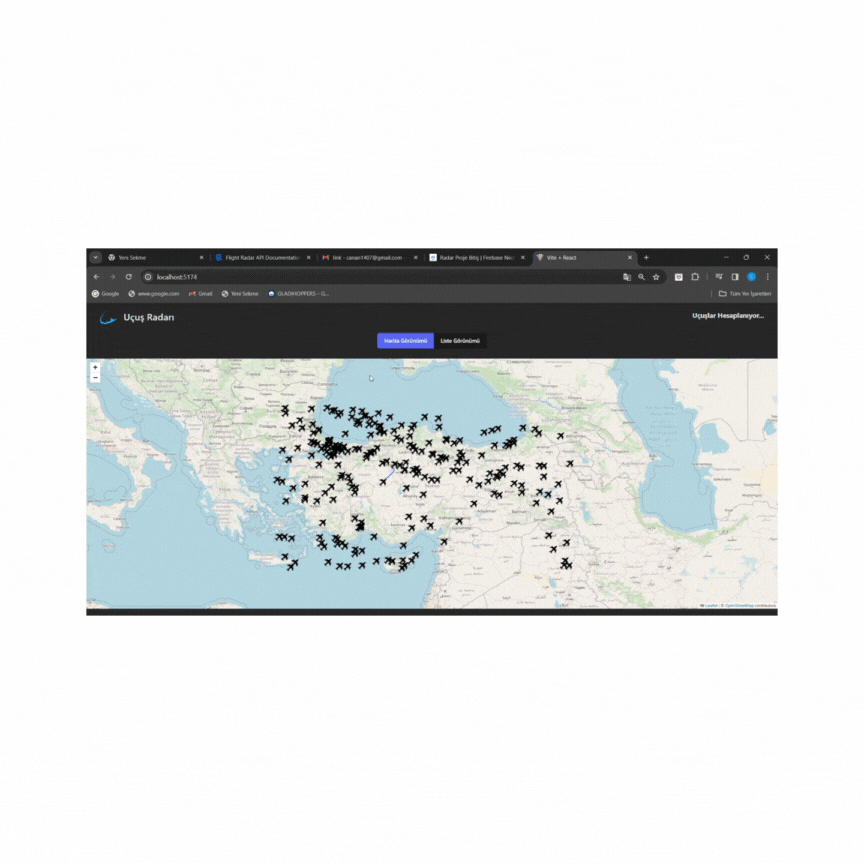

# toolkit_thunk_radar
## home page
 ✈️✈️✈️✈️✈️✈️✈️✈️✈️✈️✈️✈️

✅Redux Toolkit Thunk Flight Radar Project

🛩 This is a web application that displays flight data on a map and allows users to see flight details.

🛬In the project, Redux Toolkit was used for case management and Axios was used for data development.

🛫React-Paginate is used to list a limited number of items per page and to navigate between pages.

✈️ This project provides both a map and a list view, allowing users to switch between them and access detailed information.

## toolkit_thunk_radar

## 📚Libraries:

📍reduxjs-redux
📍axios
📍bootstrap
📍leaflet
📍react-leaflet
